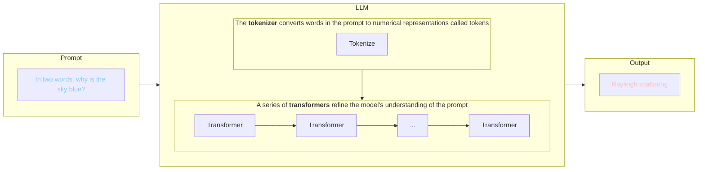

---
# try also 'default' to start simple
theme: default
colorSchema: dark
# random image from a curated Unsplash collection by Anthony
# like them? see https://unsplash.com/collections/94734566/slidev
background: https://cover.sli.dev
# some information about your slides (markdown enabled)
title: LLM-Assisted Coding Lesson
info: LLM-Assisted Coding Lesson adapted from https://github.com/coderefinery/coding-with-ai
# apply UnoCSS classes to the current slide
class: text-center
# https://sli.dev/features/drawing
drawings:
  persist: false
# slide transition: https://sli.dev/guide/animations.html#slide-transitions
transition: slide-left
# enable Comark Syntax: https://comark.dev/syntax/markdown
comark: true
# duration of the presentation
duration: 35min
# add-on
addons:
  - slidev-addon-python-runner

---

# LLM-Assisted Coding

---

# Credit

This slideshow was adapted from **CodeRefinery, Glerean, E., Lindi, B., Pöhner, I., Rantaharju, J., Christ, S., & Pfau, T. (2026). Responsible Use of Generative AI in Assisted Coding (Version 2026-04-22) [Data set]. https://github.com/coderefinery/coding-with-ai** ([CC-BY-4.0](https://creativecommons.org/licenses/by/4.0/))


---
layout: section
disabled: true
---

# Setup

VS Code and Jupyter Notebook


---
disabled: true
---

# Getting stated with VS Code

We will be using VS Code for the coding parts of this lesson. You should have a project folder on your computer containing the data needed for this lesson.

Find and open VS Code now.

---
disabled: true
---

# Open the integrated browser

VS Code includes an integrated browser that allows you to browse the web without leaving the code editor. This can be useful when using a chatbot. To open the integrated browser: 

1. Click View > Command Palette... to open the Command Palette
2. In the title bar at the top of the screen, type browser
3. Click `Browser:Open Integrated Browser`
4. Drag the browser tab to the far right side of the screen to dock it there

You can now browse the internet directly in VS Code. Go to [URL] to see the lesson slideshow.

---
disabled: true
---

# Open the project folder

You should have copies of the files necessary for this lesson in a folder on your hard drive. Let's open that folder in VS Code:

1. Click File > Open Folder
2. Navigate to the folder
3. Click Select Folder

You should now be able to see the files in the lesson folder in the left sidebar.

---
disabled: true
---

# Create a notebook

Next we'll create a notebook for this lesson:

1. Right-click in the left sidebar
2. Select New File
3. Name the file `lesson.ipynb`

A blank notebook should now open.

---
disabled: true
---

# Show line numbers

The VS Code editor is highly customizable. One feature that is disabled by default but can be extremely useful when debugging code is line numbers. We'll enable those now.

1. Click File > Preferences > Settings
2. Search for `line numbers`
3. Change `Notebook: Line Numbers` to `on`

We will now run some code to make sure the notebook is working as expected.

---
disabled: true
---

# Test the environment

The functionality of Python can be extended using external libraries. In the notebook:

1. Click `+ Code` near the top of the notebook to create a cell
2. In the cell, type:
   ```python
   import geopandas as gpd
   ```
3. Click the play button left of the cell to run it

The first time you run a notebook in VS Code, you will be prompted to install the Python and Jupyter extensions in the title bar. Extensions allow VS Code to perform additional tasks, in this case exectuing Python code. Click through to install the necessary extensions.

You will now be prompted to select the environment.

---
disabled: true
---

# Install geopandas

geopandas is a Python library that can be used to analyze and plot geospatial data. We will install it into our lesson environment now.

1. Click View > Terminal to open the Terminal
2. Install geopandas in the lesson environment: `mamba install -n llm-coding-lesson -c condaforge geopandas`

---
layout: section
---

# Large-language models

---
layout: default
---

# What is a large-language model?

Large-language models (LLM) are a type of artificial intelligence trained on vast amounts of text to predict and generate human-like text. 

They learn statistical patterns in language to predict what is likely to come next.
<br>
<br>
<br>



<!--
A token is a numerical representation of part of the word. The response is best understood as a continuation of the prompt, not a distinct answer. Mention context.
-->

---
layout: default
---

# Training an LLM to code

LLMs can be optimized for specific tasks, like coding. First, the model processes massive amounts of code to learn:

<v-clicks>

- Syntax rules for various programming languages
- Common coding patterns and idioms
- Relationships between code and comments/documentation
- How different parts of a codebase relate to each other

</v-clicks>

<v-click>

Next the model is fine-tuned through human review or by specifying additional data:

</v-click>

<v-clicks>

- **Fine-tuning:** Training on specific domains (e.g., scientific Python)
- **Instruction tuning:** Teaching the model to follow human instructions
- **Reinforcement Learning from Human Feedback (RLHF):** Aligning outputs with human preferences

</v-clicks>

<v-click>

<span class="emphasize">Models may provide incorrect responses when changes or events that happen after their training cut-off date.</span>

</v-click>

<!-- 
Vendors will do an initial tuning, for example, to impose guardrails and remove harmful content that will necessarily be included when you are scraping content from the internet. End-users can fine-tune some models themselves.
-->

---

# Limitations

LLMs cannot:

<v-clicks>

1. **Verify their own output:** They cannot run code or check if it works.
2. **Access real-time information:** Knowledge is frozen at training cutoff.
3. **Infer specific context:** They don’t know your data, infrastructure, or requirements unless you tell them.
4. **Guarantee correctness:** They optimize for “plausible sounding”, not “correct”.
5. **Explain what they did:** They can output explanations, but there is no reason to believe those explanations accurately reflect what they did.
</v-clicks>

<br>

<v-click>

<div class="highlight-box exercise">
<h1>Exercise</h1> 
Are there any limitations you are aware of or concerns that you have about LLM use? Add your thoughts to the Etherpad.
</div>

</v-click>

<!-- 

- Built on mass theft
- Power and water use to train and use
- Non-deterministic
- Training biases
- Massively subsidized, but less so lately

-->

---
layout: section
---

# Chat-Based Coding

---

# Benefits

Chat-based coding offers **full control** over how code is implemented and run.

<v-clicks>

1. **You see everything:** Every piece of code goes through your eyes and clipboard
2. **Nothing runs automatically:** You decide when and how to execute code
3. **Clear boundaries:** The LLM cannot access your files, run commands, or modify anything directly
4. **Explicit data sharing:** You control exactly what context the LLM receives
5. **Line-by-line explanations:** Generally good for simple code. Useful for understanding and debugging code.

</v-clicks>

<!-- Closest approach to traditional coding methods. Understanding/debugging useful for researchers:

Onboarding to inherited codebases
Understanding library internals
Code review preparation <-- as long as you don't actually add private/embargoed code to a prompt
Learning from other implementations

-->

---
class: exercise
---

# Exercise

Use a chatbot to understand and fix this this buggy code:

```python {monaco-run}
def calculate_statistics(data):
    mean = sum(data) / len(data)
    variance = sum((x - mean) ** 2 for x in data) / len(data)
    std = variance ** 0.5
    return {"mean": mean, "std": std, "variance": variance}

# This crashes:
#result = calculate_statistics([])
```

1. Ask the chatbot to explain what the function is doing line-by-line. Is there anything you still don't understand? Do the explanations seem correct?
2. Describe the error to the chatbot and ask it to fix the bug
3. Ask what other edge cases might cause problems

<!-- A user-defined function is a block of code that can be re-used. They are defined using the def keyword. Each function must have a name (calculate_statistics) and may optionally define arguments (here, data). The return keyword returns the result of the function.-->

---
layout: center
class: exercise
---

# Exercise

Ask a chatbot to **write a Python function to calculate the median value of a list**, then answer the following questions:

1. Does the response:
    - Use a built-in library or implement from scratch?
    - Handle edge-cases (empty list, single element)?
    - Include documentation?
2. What assumptions does this code make? What could go wrong?
3. How would you test this function to ensure it’s correct?

Share your thoughts in the collaborative note document.

---
class: exercise
---

# Chalkboard

```python {monaco-run}
# Questions
# 
# 1. Does the response:
#     - Use a built-in library or implement from scratch?
#     - Handle edge-cases (empty list, single element)?
#     - Include documentation?
# 2. What assumptions does this code make? What could go wrong?
# 3. How would you test this function to ensure it’s correct?
#
#
#
#
#
#
#
#
#
#
#
#
```

---

# Selecting a model

---

# Planning and production modes

<v-clicks>

1. **Exploration:** Ask the LLM about ways to approach your problem. Determine  
2. **Planning:** Set up your files, folders, and environment.
3. **Production:** Provide detailed instructions. Review code for errors, documentation, and security.

</v-clicks>

<!-- This is mostly project management. How will you know if the code is working as expected? -->

---

# Building a script

<v-clicks>

1. **Have a plan:** Understand what you want to accomplish and how you will know if you succeeded.
2. **Suggest tools:** Tell the LLM what language and libraries you'd like to use
3. **Make it modular:** Instead of trying to build an entire application at once, build it in chunks that are easier to review and test.
4. **Provide detailed prompts:** Use your knowledge of the language and packages to formulate specific prompts, for example, using function signatures
5. **Ask for documentation:** Ask the LLM to annotate code with docstrings and type hints
6. **Manage context:** Understand how previous prompts may affect the output of the LLM 

</v-clicks>

---

# Managing context effectively

Context describes all the information available to the LLM.

| Element                  | Impact                             |
|--------------------------|------------------------------------|
| Your prompts             | Directly shape the response        |
| LLM's previous responses | Become part of the “memory”        |
| Code you paste           | Provides examples and patterns     |
| Error messages shared    | Help with debugging                |
| Instructions to the LLM  | Customize tone, technologies, etc. |

When a chat is no longer useful or has been left idle for a long time, **start a new one**

<!-- 

- Context and even vendor instructions can break down in long chats. For example, safety guardrails can become ineffective.
- For paid services, large context windows can have an enormous effect on token costs

-->

---

# Vibe Coding

Describes a more relaxed approach where the LLM handles all coding and its code is implemented with little or no review.

<v-click>

Avoid when you are creating:

- Research code that will be published
- Code that processes real data
- Anything that will be shared or maintained
- Security-sensitive applications

</v-click>

<v-click>
And remember that **you are responsible for the code you run!** Vibe-coded applications may include undetected security issues that can put your computer and account at risk.
</v-click>

<!-- Tempting but unwise, especially on work hardware. Running unreviewed code is a violation of SI policy. -->

---

## Risks of using LLMs

<v-clicks>

- **Data handling:** Data may be be used for training models or shared with other users. Sharing private data can have moral and legal consequences.
- **Hallucinated packages:** Code may include packages that do not exist. Attackers can place malware at likely repository names.
- **Prompt injection:** LLMs struggle to distinguish between legitimate and malicious prompts. Attackers can hide malicious prompts in websites or attachments, which can trick an LLM into leaking data or performing other harmful actions.
- **Vulnerable code:** Code produced by LLMs is not necessarily secure. Be careful executing such code, especially if users are able to provide input.
  - Injection flaws
  - Broken authentication
  - Security misconfiguration
  - Insecure deserialization
  - And more!

</v-clicks>

<!-- IP risks. Paper reviews. Underline that learners are not expected to understand the particulars of these vulnerabilities. -->

---


## Security Checklist

When selecting a model:

<label><input type="checkbox">Follow organizational policies</label>
<label><input type="checkbox">Read the privacy policy and terms of service</label>
<label><input type="checkbox">Understand what data is transmitted and retained</label>
<label><input type="checkbox">Use enterprise tools to protect data</label>

---

## Security Checklist

When using a chatbot:

<label><input type="checkbox">Remove or protect credentials before LLM interaction</label>
<label><input type="checkbox">Never paste sensitive data - use synthetic examples</label>
<label><input type="checkbox">Verify that all suggested packages are legitimate</label>
<label><input type="checkbox">Review generated code for security vulnerabilities</label>

---

# Coding Checklist

When using an LLM to code:

<label><input type="checkbox">Work modularly - small functions you can test</label>
<label><input type="checkbox">Document your process - note which parts were AI-generated</label>
<label><input type="checkbox">Understand the code - if you can’t explain it, don’t use it</label>

---
layout: section
---

# Example: Geospatial data

---
layout: default
---

# Validating geospatial data

- Accurate locality information is crucial to research in many domains
- Identifying incorrect coordinates is useful for both researchers and collection managers assessing data about their collections
- Manually checking coordinates is labor-intensive, so here we will try to **develop a script that allows us to validate a large number of coordinates at once.**

---

# Core geospatial concepts

<v-clicks>

- **Geometries** are mathematical representations of shapes (Point, LineString, Polygon, etc.)
- **Spatial operations** calculate how geometries relate to each other (intersects, within, touches, disjoint, etc.)
- **Coordinate reference systems (CRS)** are used to measure locations on the Earth's surface. The most common one is `epsg:4326`, which is the geographic CRS used by GPS.
  - A **geographic CRS** records coordinates as degrees. Global, used by GIS, unreliable for calculating distance and area.
  - A **projected CRS** projects coordinates to a flat map. Units are meters, feet, etc. Local, good for calculating distance and area with the right CRS.
- **Projection** is the process of translating coordinates between different CRS

</v-clicks>

<!-- When using spatial operations to compare, geometries must use the same CRS -->

---

# Goal of the coding exercise

Write a Python script to identify and visualize problematic coordinates using the following datasets:

- NMNH specimens from Maine as a Darwin Core CSV file (https://doi.org/10.15468/dl.rwtjmj)
- County polygons for Maine from GADM (https://gadm.org/)

<br>

<div class="highlight-box exercise">
<h2>Exercise</h2>
Let's take a few minutes to explore the problem. Ask the LLM for strategies for approaching this problem based on what we've covered so far. What good libraries exist? What features should the script have? Add what you learn to the collaborative notes document.
</div>

---
layout: center
class: text-center
---

# Learn More

[Documentation](https://sli.dev) · [GitHub](https://github.com/slidevjs/slidev) · [Showcases](https://sli.dev/resources/showcases)

<PoweredBySlidev mt-10 />
